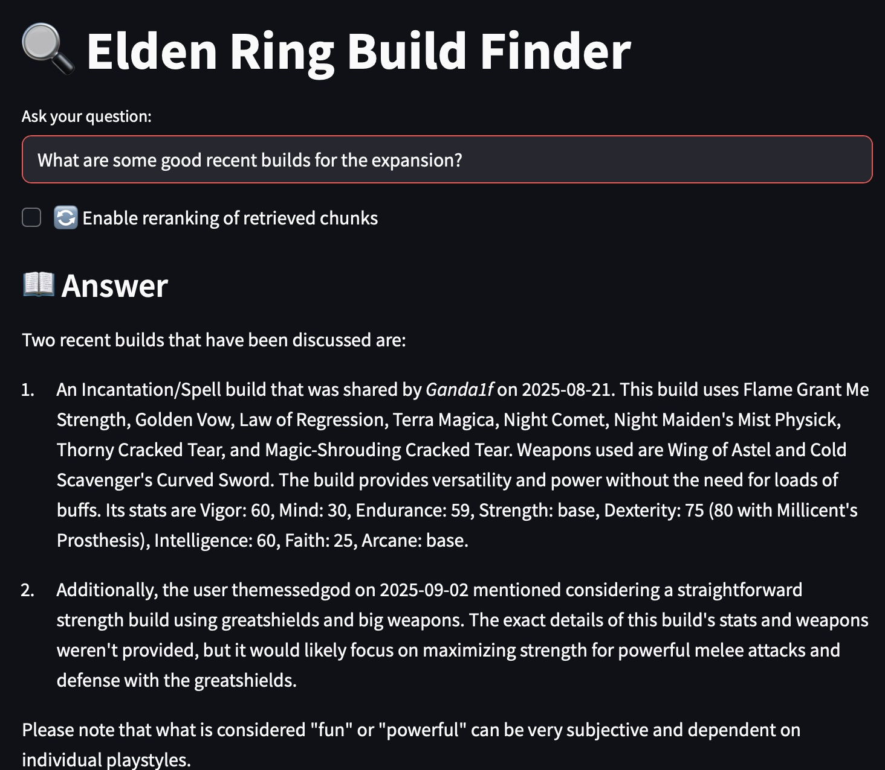
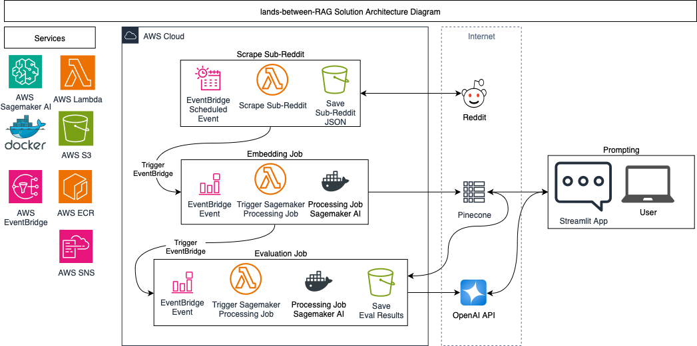
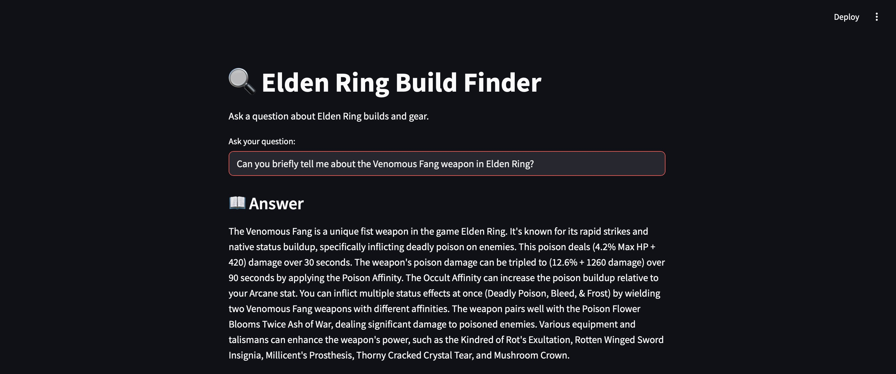

# Lands Between RAG Application

This project is a Retrieval-Augmented Generation (RAG) application designed to help players explore up-to-date **Elden Ring character builds** by drawing on the latest discussions from Reddit. The goal is to surface recent, community-driven insights that go beyond what a static model can provide, giving players fresh ideas for optimizing their builds.  

LLMs aren’t always up to date, so they often miss recent shifts in game metas or new releases. For example, GPT-4 (released March 2023) was trained before Elden Ring’s expansion, Shadow of the Erdtree (June 2024), so it has no knowledge of that content. To solve this, I built data transformation and RAG pipelines that generate a custom corpus of expansion data and feed the model relevant context at time of inference. This way it can answer questions about the new content with accuracy and let the user stay current on the game.

Keeping the corpus fresh requires more than manual updates. It requires an architectural solution. I designed and automated the pipeline using cloud-based services on Amazon Web Services (AWS).

To evaluate the pipeline, Reddit posts from a community dedicated to Elden Ring builds were collected daily over a 30-day period. After each scrape, the index was refreshed with newly embedded vectors, and an evaluation script generated responses to five benchmark queries using the top-five most similar posts. At the end of the 30 days, performance was assessed using daily metrics to measure retrieval quality and consistency.

[](https://opensource.org/licenses/MIT)
[](https://www.python.org/downloads/)

## Example Output

---

## Quick Start

```bash
# Clone the repository
git clone https://github.com/caseywhorton/lands-between-RAG.git
cd lands-between-RAG

# Set up environment
python3 -m venv .venv
source .venv/bin/activate
pip install -r requirements.txt

# Configure environment variables
cp .env.example .env
# Edit .env with your API keys
```

## Key Insights

1. **RAG Applications and Relevance**  
   Retrieval-Augmented Generation (RAG) applications can provide a corpus of recent, relevant data for a specific use case. For example, using recent data for a newly released video game allows even an older LLM to generate responses based on up-to-date information.

2. **Infrastructure Requirements**  
   RAG applications for recent data require an automated infrastructure to update and evaluate text data continuously, ensuring the LLM has access to fresh, accurate information.

3. **Evaluating LLM Accuracy with Context**  
   Assessing the accuracy of an LLM with additional context primarily measures the quality of the data in the corpus. If the corpus contains minimal or flawed information on a subject, evaluation metrics are expected to be low, regardless of the model’s underlying capability.

---

### What Works
- Embedding the `full_text` (post + top comments) improves relevance.  
- Cleaning markdown formatting with regex enhances embedding quality.  
- Pinecone similarity scores > 0.7 indicate high relevance.  
- Including time-dependent information (e.g., timestamps for Reddit posts) allows recent posts to be accurately retrieved and contextualized.

---

### Limitations
- Without RAG context, the model may respond: *"I don't have access to current Reddit discussions."*  
- Evaluating the RAG pipeline: metrics are useful for testing the retrieval of expected, straightforward information, but assessing qualitative answers is more challenging since there is no single 'correct' response.

---

## Case Study: Venomous Fang Weapon

### Without RAG Context

**Query**: *"Can you briefly tell me about the Venomous Fang weapon in Elden Ring?"*

**Response**: 
> As of now, specific details about the Venomous Fang weapon in Elden Ring are not available...

### With RAG Context (Retrieved from Reddit)

**Same Query** → **Retrieved 3 relevant posts** → **Enhanced Response**:

> The Venomous Fang is a unique fist weapon in Elden Ring known for its rapid strikes and native poison status. It's lightweight and can inflict "Deadly Poison" on enemies, which deals significant damage over time. It can be enhanced by applying Poison or Occult Affinities, tripling the poison damage or increasing the poison buildup respectively...

**Result**: Accurate, detailed, community-validated information

---

## Architecture



---

## Process Overview

The RAG pipeline follows three main stages:

### 1. Ingest Reddit Posts into S3
Services Used: _AWS EventBridge, AWS Lambda, AWS S3, Reddit_
- **Source**: Scrape relevant posts from Elden Ring subreddits using PRAW
- **Storage**: Store raw post data (title, body, comments) in Amazon S3 as JSON
- **Frequency**: Configurable cron job for fresh content

### 2. Transform and Embed Posts into Pinecone
Services Used: _AWS Sagemaker AI, AWS EventBridge, AWS Lambda, Docker, Pinecone_
- **Preprocessing**: Clean text (strip markdown, remove boilerplate and stop words)
- **Embedding Model**: `all-mpnet-base-v2` for high-quality vector representations
- **Vector Store**: Pinecone index with metadata (post ID, subreddit, weapon tags)
- **Processing**: SageMaker for scalable batch processing

### 3. Evaluate the RAG Application with Test Set
Services Used: _AWS Sagemaker AI, AWS EventBridge, AWS Lambda, AWS S3, Docker, Pinecone, OpenAI_
- **Pull test data**: Test data is a CSV with test queries and sample responses
- **Preprocessing**: Clean text (strip markdown, remove boilerplate and stop words)
- **Embedding Model**: Use the same embedding model to embed test query text
- **Retrieval**: Semantic search in Pinecone for top-5 relevant posts for each test query
- **Augmentation**: Inject retrieved content into LLM context
- **Generation**: GPT-3.5/4 produces grounded, accurate responses
- **Evaluate**: Evaluate responses using NLP metrics, save results to S3

### 4. Query and Generate Responses
Services Used: _Streamlit, Pinecone, OpenAI_
- **User Query**: "What's a good poison build?"
- **Retrieval**: Semantic search in Pinecone for top-5 relevant posts
- **Augmentation**: Inject retrieved content into LLM context
- **Generation**: GPT-3.5/4 produces grounded, accurate responses

---

## Models & Performance

| Component     | Model                | Performance Notes              | Cost   |
|---------------|----------------------|--------------------------------|--------|
| Embeddings    | `all-mpnet-base-v2` | Best semantic similarity       | Free   |
| LLM (Prod)    | `gpt-4`             | Highest quality responses      | $$$    |
| LLM (Dev)     | `gpt-3.5-turbo`     | Good balance of cost/quality   | $$     |
| Baseline      | `bert-base-uncased` | Poor performance (comparison)  | Free   |

### Evaluation Metrics


**Metric Descriptions:**

- **rouge1**: Measures unigram (single word) overlap between the generated text and reference text.  
- **rougeL**: Measures the longest common subsequence between the generated text and reference text.  
- **bleu**: Measures n-gram precision of the generated text against reference text.
   - For example: not only does "short" and/or "sword" appear, but "short sword" appears
- **keyword_match**: Measures the proportion of relevant keywords in the generated text that match the reference.  
- **chunk_overlap_score**: Measures the proportion of text chunks in the generated output that overlap with the reference, capturing content-level similarity.


**Interpretation:** 
The test queries and expected responses were designed to evaluate the RAG pipeline and measure how corpus growth impacted the accuracy of the model’s answers. The expectation was that as the corpus expanded, more relevant text would appear for the queries, improving alignment with the expected responses. While the model’s answers did evolve over time, they did not consistently match the expected outputs.  
For 3 of the 5 test queries, I focused on straightforward descriptions of weapons or armor from the base game or the expansion. In these cases, performance depended heavily on whether the index contained text explicitly describing the item. For example, the Venomous Fang weapon was frequently discussed by players due to its popularity in certain builds, which led to strong evaluation scores. By contrast, Royal Knight’s Resolve was rarely mentioned, resulting in weaker metrics.  
For the other 2 queries, I tested the pipeline on generating build ideas—a more subjective task. My expected responses reflected common community strategies, but the evaluation metrics did not improve much, which is not surprising given the open-ended nature of the queries.  
Overall, these results suggest that metrics like ROUGE, BLEU, and context-chunk scoring work well when evaluating factual descriptions or definitions  where there is clear ground truth in the corpus. However, they are less effective for subjective or creative queries, such as build recommendations.  
 While my evaluation design has limitations, it highlights both the strengths and weaknesses of text-based metrics for assessing RAG pipelines. 

---

## Setup & Deployment

### Prerequisites

- AWS Account with SageMaker access
- [Pinecone](https://www.pinecone.io) account (free tier available)
- [OpenAI API](https://platform.openai.com) key
- Reddit API credentials (PRAW)

### Environment Setup

1. **SageMaker Studio Domain**
   ```bash
   aws sagemaker create-domain --domain-name lands-between-rag
   ```

2. **Environment Variables**
   ```bash
   export OPENAI_API_KEY="your-key-here"
   export PINECONE_API_KEY="your-pinecone-key"
   export REDDIT_CLIENT_ID="your-reddit-client-id"
   export REDDIT_CLIENT_SECRET="your-reddit-secret"
   ```

### Docker Containers

Build multi-platform containers for AWS deployment:

```bash
# Embedding processor
docker build --platform linux/amd64 --no-cache -t rag-embedding .
docker tag rag-embedding:latest <acct>.dkr.ecr.us-east-1.amazonaws.com/rag-embedding:latest

# Evaluation processor  
docker build --platform linux/amd64 --no-cache -t rag-evaluation .
docker tag rag-evaluation:latest <acct>.dkr.ecr.us-east-1.amazonaws.com/rag-evaluation:latest

# Push to ECR
aws ecr get-login-password --region us-east-1 | docker login --username AWS --password-stdin <acct>.dkr.ecr.us-east-1.amazonaws.com
docker push <acct>.dkr.ecr.us-east-1.amazonaws.com/rag-embedding:latest
docker push <acct>.dkr.ecr.us-east-1.amazonaws.com/rag-evaluation:latest
```

### Lambda Layer (PRAW)

```bash
# Create PRAW layer for Reddit scraping
docker run --rm -v $(pwd):/var/task \
    public.ecr.aws/lambda/python:3.10 \
    /bin/bash -c "pip install praw -t /var/task/python/ && exit"

zip -r praw_layer.zip python/
aws lambda publish-layer-version --layer-name praw-layer --zip-file fileb://praw_layer.zip
```

### CDK Deployment

```bash
mkdir sagemaker-cdk-project && cd sagemaker-cdk-project
python3 -m venv .venv && source .venv/bin/activate
npm install -g aws-cdk
pip install aws-cdk-lib constructs boto3
cdk init app --language python

# Deploy infrastructure
cdk deploy
```

---

## Project Structure

```
lands-between-RAG/
├── rag_streamlit_app/ # Streamlit application for querying index
├── └──  test_queries.json # dictionary for RAG evaluation
├── scraper_lambda/ # lambda function for scraping Reddit
├── Docker/
│   ├── embedding/         # SageMaker processing container and code
│   └── evaluation/        # Model evaluation container and code
├── cdk/                   # Infrastructure as code
├── tests/                 # Unit and integration tests
├── requirements.txt
└── README.md
```

---

## Usage

### Basic Query

Navigate to the **rag_streamlit_app** directory and run:  

`streamlit run app.py`



---

## Testing

For testing offline, run Docker containers with a .env file.  

```
docker run \
  -e AWS_ACCESS_KEY_ID=$(aws configure get aws_access_key_id) \
  -e AWS_SECRET_ACCESS_KEY=$(aws configure get aws_secret_access_key) \
  --env-file .env \
  -p 9000:8080 <container name>
  ```

---

## Monitoring & Metrics

- **CloudWatch**: Processing job metrics, Lambda execution times
- **Pinecone**: Query latency, index usage
- **Evaluation**: Rouge, Bleu, Context Overlap, Keyword Matches

---

## Contributing

1. Fork the repository
2. Create a feature branch (`git checkout -b feature/amazing-feature`)
3. Commit changes (`git commit -m 'Add amazing feature'`)
4. Push to branch (`git push origin feature/amazing-feature`)
5. Open a Pull Request

---

## License

This project is licensed under the MIT License - see the [LICENSE](LICENSE) file for details.

---

## Acknowledgments

- [FromSoftware](https://www.fromsoftware.jp/) for creating Elden Ring
- [r/Eldenring](https://reddit.com/r/EldenringBuilds) community for build discussions
- [Sentence Transformers](https://www.sbert.net/) for embedding models
- [Pinecone](https://www.pinecone.io/) for vector search infrastructure

---

## Support

- **Bug Reports**: [GitHub Issues](https://github.com/caseywhorton/lands-between-RAG/issues)
- **Feature Requests**: [GitHub Discussions](https://github.com/caseywhorton/lands-between-RAG/discussions)
- **Contact**: [caseywhorton@gmail.com](mailto:caseywhorton@gmail.com)